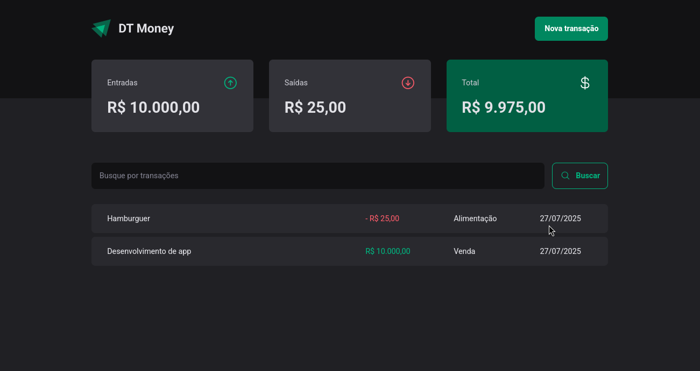
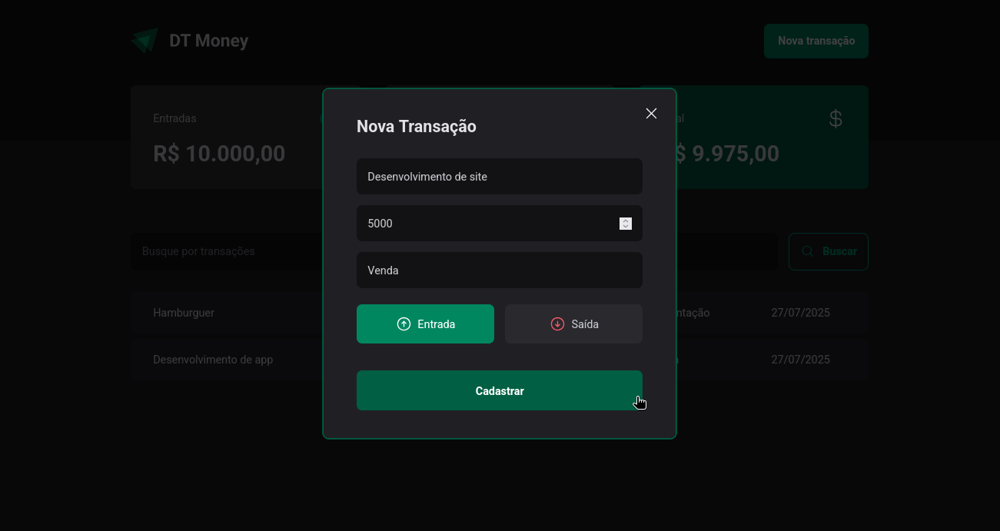
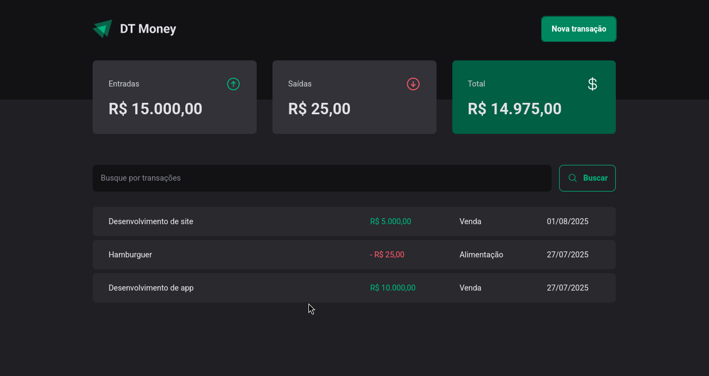

# 💰 DT Money

Aplicação de controle financeiro desenvolvida durante o curso **Ignite React.js (2023)** da **Rocketseat.**

## 📋 Sobre o projeto

O **DT Money** é uma aplicação web que permite aos usuários gerenciar sua vida financeira de forma simples e prática. Com ela, é possível registrar transações de entrada e saída, acompanhar o histórico financeiro e realizar buscas por transações específicas.

### 📷 Preview





## ✨ Funcionalidades

- ✅ Cadastro de transações (entrada e saída)

- 📄 Listagem de transações com valores formatados

- 🔍 Filtro e busca de transações por descrição

## 🛠️ Tecnologias e conceitos aplicados

- **React.js** – biblioteca principal para construção da interface
- **Vite** – bundler moderno e rápido para desenvolvimento
- **TypeScript** – tipagem estática para maior segurança
- **Styled Components** – estilização com CSS-in-JS
- **Radix UI** – componentes acessíveis e customizáveis
- **Axios** – cliente HTTP para consumo de API
- **JSON Server** – simulação de uma API REST
- **React Hook Form + Zod** – para formulários com validação eficiente
- **Phosphor Icons** – biblioteca de ícones
- **Boas práticas de performance** – uso de `useMemo`, `useCallback`
- **Context API com useContextSelector** – acesso otimizado ao estado global

## 🖥️ Como rodar a aplicação

Primeiramente, crie um arquivo `db.json` com o seguinte conteúdo:

```json
{
  "transactions": []
}
```

> [!NOTE]
> Este arquivo servirá como um banco de dados para o JSON server.

Execute o JSON server:

```bash
npm run serve
```

Por fim, execute a aplicação:

```bash
npm run dev
```
